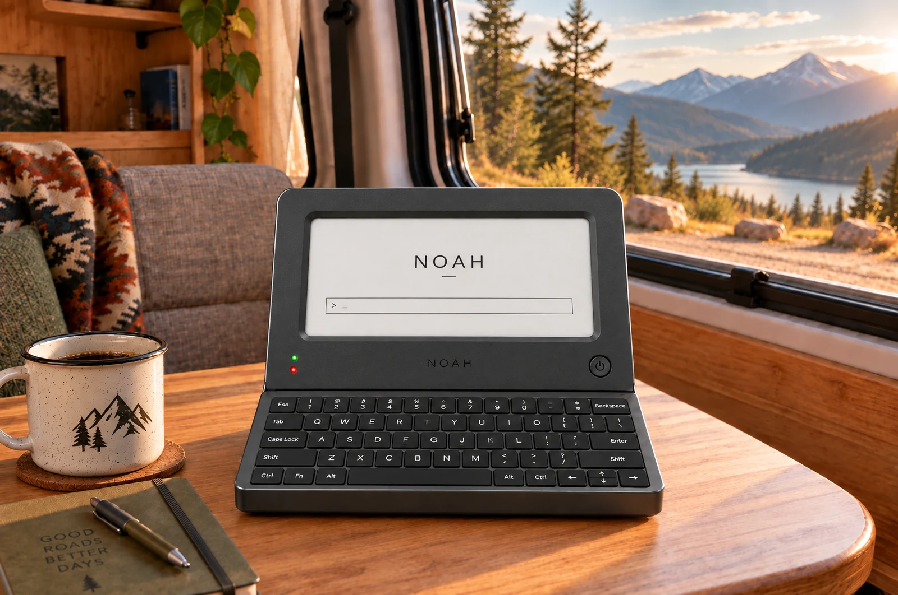
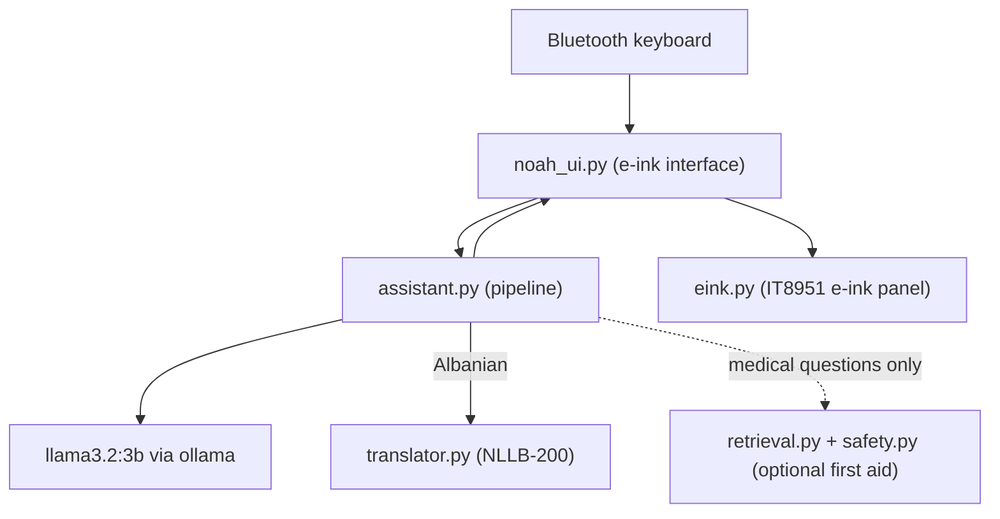
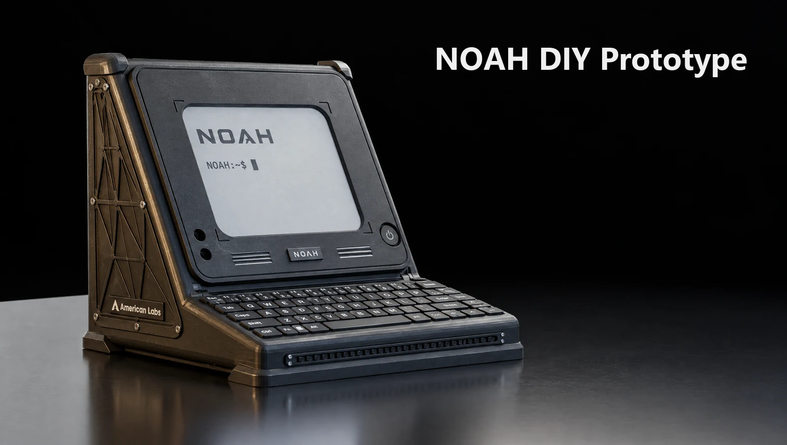

# Noah

**Offline AI assistant, built by American Labs.** [noahtech.ai](https://noahtech.ai)



Noah is an AI assistant that runs on its own small computer, with no internet and no cloud. You type a question on the keyboard and the answer shows up on the screen. The model, your questions, and its answers all stay on the device. I built it so you can use an AI assistant anywhere, keep it private, and not depend on a connection or an account.

It is a general assistant, so you can ask it everyday questions, have things explained, get help with small bits of code, write and brainstorm, or just talk. It answers from what the model already knows, so it has no live information like news or weather, and like any language model it can be wrong. It tries to be honest when it is not sure.

## Features

- **Runs fully offline.** Everything happens on the device. No internet, no cloud, no account.
- **Local AI conversations.** A llama3.2:3b model runs on the device through [ollama](https://ollama.com).
- **Private by design.** Your questions and the answers never leave the hardware.
- **Albanian and English.** It notices the language you used and replies in the same one, with translation done locally.
- **E-ink screen.** Easy on the eyes, and it keeps the last image even with the power off.
- **Physical keyboard and power button.** Type on a pocket keyboard. A short press sleeps the device, and a long press powers it off.
- **Boots straight into the assistant.** Power it on and it comes up ready to type.
- **Optional first aid help.** If you ask a real medical question, it can answer from a small library of trusted first aid references and run that answer through a safety layer. This is off unless you set it up, and it does not change what Noah is for.

## Hardware

- **NVIDIA Jetson Orin Nano 8 GB** (JetPack 6.x, Ubuntu 22.04). It runs the model and everything else.
- **7.8 inch IT8951 e-ink panel** at 1872 by 1404.
- **Bluetooth pocket keyboard** (a BlackBerry Q10 in this build).
- **A power button and two status LEDs.**
- **USB-C power**, with room in the design for a battery and a small solar panel.

The full parts list is in [hardware/BOM.md](hardware/BOM.md), the wiring is in [hardware/wiring.md](hardware/wiring.md), and a printable enclosure is in [3d-models/](3d-models/).

## Software architecture

The pieces are small, and each one does a single job. `noah_ui.py` runs the screen and the keyboard. It hands your question to `assistant.py`, which is the pipeline. Most questions go straight to the local model through ollama. If you wrote in Albanian, `translator.py` translates the question to English for the model and the answer back to Albanian. Only clearly medical questions take an extra step through `retrieval.py` and `safety.py`, which is the optional first aid part. The answer returns to `noah_ui.py`, which draws it on the e-ink panel through the `eink.py` driver.



There is a longer write-up in [docs/architecture.md](docs/architecture.md).

## Repository structure

```text
Noah/
├── README.md
├── LICENSE
├── software/            # all the device code
│   ├── noah_ui.py       # e-ink interface, keyboard, power button
│   ├── assistant.py     # the pipeline: model, translation, optional retrieval
│   ├── eink.py          # IT8951 e-ink driver
│   ├── translator.py    # Albanian and English translation (NLLB-200)
│   ├── retrieval.py     # optional first aid retrieval
│   ├── safety.py        # optional first aid safety layer
│   ├── ingest.py        # builds the optional first aid index
│   ├── noah_splash.py   # early boot splash screen
│   ├── recovery_strips.py # e-ink screen recovery tool
│   ├── assets/          # logo art (SVG and PNG)
│   ├── system/          # systemd units and logind config
│   ├── eval/            # evaluation scripts and question sets
│   ├── tools/           # controller diagnostics
│   └── README.md        # full software setup guide
├── hardware/
│   ├── BOM.md           # bill of materials
│   ├── wiring.md        # wiring guide
│   └── assembly.md      # assembly notes
├── 3d-models/           # printable enclosure and the Blender source
│   └── README.md
└── docs/
    ├── architecture.md
    └── safety-system.md # the optional first aid safety layer
```

## Quick start

You need the hardware listed above, then the software on the Jetson.

1. Print the enclosure. See [3d-models/README.md](3d-models/README.md).
2. Buy the parts. See [hardware/BOM.md](hardware/BOM.md).
3. Wire the panel, button, and LEDs. See [hardware/wiring.md](hardware/wiring.md).
4. Flash JetPack, then install the software.

Once JetPack is on the Jetson, the core software install is:

```bash
# system packages and Python libraries
sudo apt update && sudo apt install -y python3-pip busybox librsvg2-bin
pip3 install chromadb requests pillow numpy rank_bm25 langdetect \
             ctranslate2 transformers sentencepiece Jetson.GPIO spidev

# the local model runtime
curl -fsSL https://ollama.com/install.sh | sh
ollama pull llama3.2:3b
ollama pull nomic-embed-text
```

After that you enable the systemd services so Noah starts on boot. The exact commands, along with the Albanian translation model and the optional first aid library, are in [software/README.md](software/README.md). Noah runs without either of those two extras.

## Development

All the code is in [software/](software/), and it is plain Python. The two files worth starting with are `assistant.py`, the pipeline that turns a question into an answer, and `noah_ui.py`, the screen and keyboard loop.

- To change how Noah answers, edit the prompts and routing in `assistant.py`.
- To change what the screens look like, edit `noah_ui.py`.
- The safety layer tests itself. Run `python3 safety.py` and it should print `ALL PASS`.
- There is an eval harness in [software/eval/](software/eval/) for running batches of questions.

Most of the code expects to run on the Jetson with the panel attached. `safety.py` and the eval scripts are the parts you can run on an ordinary computer.

## Limitations

- The model is small, with 3 billion parameters. It is quick and useful on this hardware, but it is not as capable as a large cloud model, so expect the odd mistake.
- There is no internet, so it cannot look anything up, and its knowledge stops at a training cutoff.
- The e-ink screen is black and white and refreshes at its own pace, so long answers are split across pages.
- Albanian answers go through machine translation, which is usually fine but sometimes awkward.
- This is a personal project on one specific hardware build, not a finished product. Some of it is rough.

## The first aid feature

Noah began as a first aid device, and that part still exists as an optional feature. If you install the reference library, medical questions are answered from trusted first aid sources and checked against a set of safety rules. It is a safeguard for medical questions, not the point of the project, and it stays off until you set it up. It is also not a medical device and has not been reviewed by anyone qualified, so treat it as a backup for when nothing better is available. The details are in [docs/safety-system.md](docs/safety-system.md).

## Prototype

The image at the top shows the sleek design. Before that, Noah ran on the DIY prototype below.



## License

The code and 3D models are under the [MIT license](LICENSE). The Noah name and logo belong to American Labs.

## About

Noah is a project by [American Labs](https://american.al). The idea is simple: an AI assistant you actually own, running on its own hardware, with nothing leaving the device. You can find more at [noahtech.ai](https://noahtech.ai).
